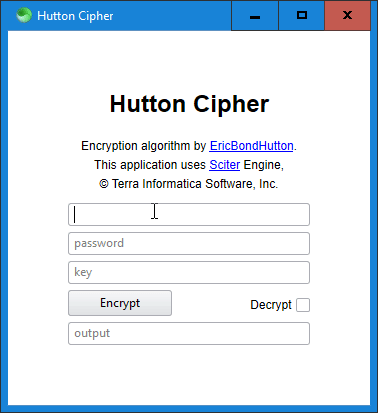

# Hutton Cipher

Run `cargo build --release` to compile `hutton.dll`, then place [scapp.exe](https://github.com/c-smile/sciter-sdk/blob/master/bin.win/x32/scapp.exe) inside this folder and run it.

I would like to remake this using JavaScript, but I haven't been able to get the Rust bindings for Sciter.JS to work yet😢